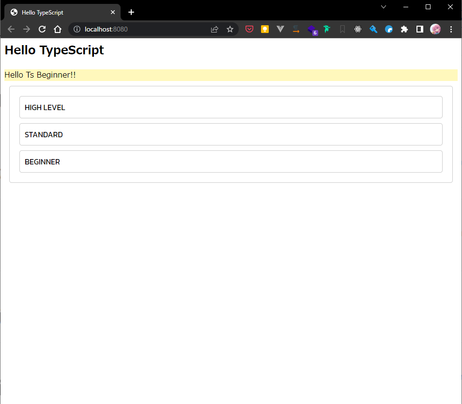
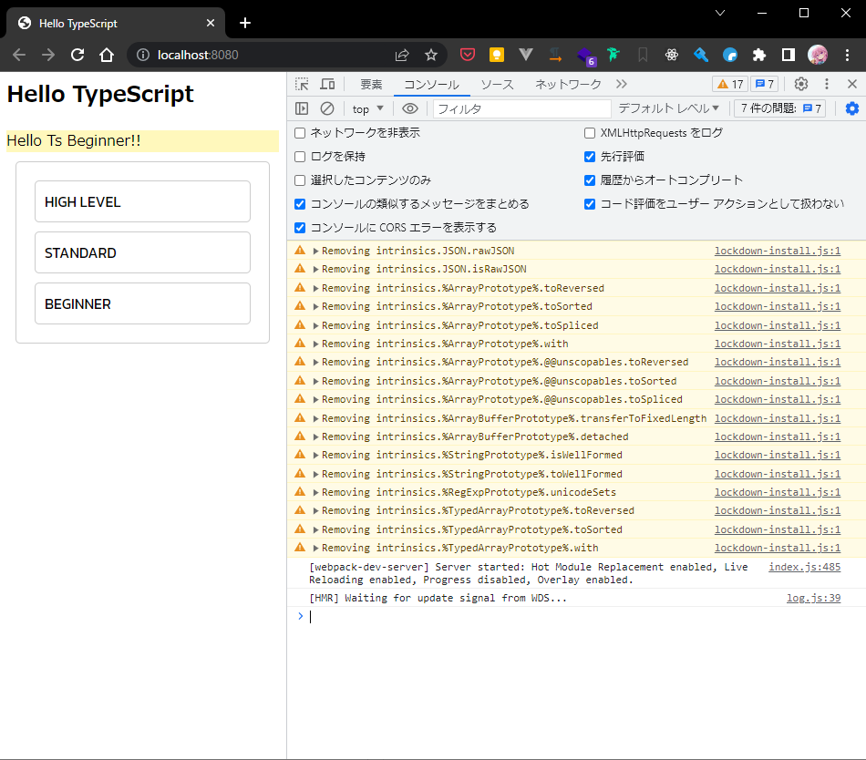
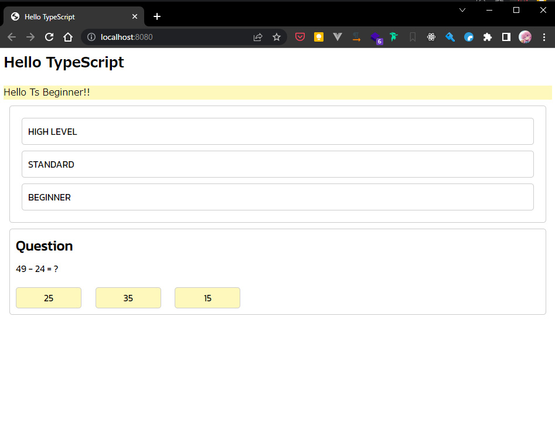

# typescriptWithHtml-demo

このリポジトリは、WebPack+TypeScript を使って HTML を操作することを目的とした学習用リポジトリです。

以下のコマンドを実行することで、ローカル環境で動作確認ができます。

```bash
# webpackビルド
$ npm run build
# webpackサーバ起動
$ npm run start
```

また、以下のコマンドを実行することで、テストコードの実行と、TypeScript のコンパイルができます。

```bash
# test実行
$ npm run test
# tscコンパイル
$ npm run tsc
```

---

## 目次 学習内容

0. はじめに
1. HTML の要素の基本的な制御
2. HTML の要素の属性の制御
3. 課題 1
4. 課題 2
5. Extra1

---

# TUTORIAL はじめに

```bash
npm install
```

1. 上記のコマンドを使用して外部のライブラリをインストールします。
2. 以下のコマンドを使用して、ローカル環境で動作確認を行いましょう。

```bash
npm run start
```

3. コンソールに以下のようなメッセージが表示された後、http://localhost:8080/ にアクセスしてみましょう。

```bash
PS C:\Users\樋口一葉\sotuken\typescriptWithHtml-traning> npm run start

> typescript-demo@1.0.1 start
> webpack serve --mode=development

<i> [webpack-dev-server] Project is running at:
<i> [webpack-dev-server] Loopback: http://localhost:8080/
<i> [webpack-dev-server] On Your Network (IPv4): http://172.18.94.116:8080/
<i> [webpack-dev-server] Content not from webpack is served from 'C:\Users\樋口一葉\sotuken\typescriptWithHtml-traning\public' directory
asset app.js 266 KiB [emitted] (name: app)
runtime modules 27.3 KiB 12 modules
modules by path ./node_modules/ 178 KiB
  modules by path ./node_modules/webpack-dev-server/client/ 71.8 KiB 16 modules
  modules by path ./node_modules/webpack/hot/*.js 5.3 KiB
    ./node_modules/webpack/hot/dev-server.js 1.94 KiB [built] [code generated]
    + 3 modules
  modules by path ./node_modules/html-entities/lib/*.js 81.8 KiB
    ./node_modules/html-entities/lib/index.js 7.91 KiB [built] [code generated]
    ./node_modules/html-entities/lib/named-references.js 73 KiB [built] [code generated]
    + 2 modules
  ./node_modules/ansi-html-community/index.js 4.16 KiB [built] [code generated]
  ./node_modules/events/events.js 14.5 KiB [built] [code generated]
modules by path ./src/ 565 bytes
  ./src/app.ts 286 bytes [built] [code generated]
  ./src/models/helloWorld.ts 279 bytes [built] [code generated]
webpack 5.88.0 compiled successfully in 1851 ms
```

以下のような画面が表示されたら成功です。



---

# LESSON1 HTML の要素の基本的な制御

始めに、HTML の要素の基本的な制御方法を学習します。
いきなりですが、以下のコードを見てみましょう。

```typescript
// HTMLの要素を取得する
const element = document.getElementById(`${htmlの要素のid}`);

// HTMLの要素のテキストを取得する
const text = element.innerText;

// HTMLの要素のテキストを設定する
element.innerText = "Hello World";
```

このコードは、HTML の要素を取得して、その要素のテキストを取得して、そのテキストを設定しています。この Lesson では、このように HTML の要素を操作する方法を学習します。

## 基本的な制御とは

**HTML の基本的な制御**とは、以下のようなことを指します。

- HTML の要素を取得する
- HTML の要素を追加する
- HTML の要素を削除する
- HTML の要素にイベントを設定する

ほかにも、HTML の要素を操作する方法はたくさんありますが、今回は上記の操作方法を学習します。

## HTML の要素を取得する

HTML の要素を取得するには、以下のようにします。

```typescript
// idが"helloWorld"の要素を取得する
const elementIdHelloWorld = document.getElementById("helloWorld");

// classが"helloWorld"の要素を取得する
const elementClassHelloWorld = document.getElementsByClassName("helloWorld");

// タグ名が"div"の要素を取得する
const elementTagDiv = document.getElementsByTagName("div");
```

ほかにも、HTML の要素を取得する方法はたくさんありますが、今回は上記の操作方法を学習します。

ここで使用した`document`のメソッドは、以下のようになっています。

### getElementById メソッド

このメソッドは、HTML 要素の ID を指定して要素を取得します。ID は HTML 内で一意でなければなりません（つまり、ページ内で一度だけ使用できます）。
ID は、HTML 要素の id 属性で指定されます。

```html
<div id="helloWorld">Hello World</div>
```

### getElementsByClassName メソッド

このメソッドは、HTML 要素のクラス名を指定して一致するすべての要素を取得します。クラスはページ内で何度でも使用できます。

```html
<ul>
  <li class="helloWorld">Hello World</li>
  <li class="helloWorld">Hello World</li>
  <li class="helloWorld">Hello World</li>
</ul>
```

`<li class="helloWorld">Hello World</li>`のすべての要素を取得します。

### getElementsByTagName メソッド

このメソッドは、HTML 要素のタグ名を指定して一致するすべての要素を取得します。たとえば、すべての<p>タグ（段落）や<div>タグ（領域）を取得できます。

```html
<div>Hello World</div>
<div>Hello World</div>
<div>Hello World</div>
```

`<div>Hello World</div>`のすべての要素を取得します。

### **例題**

1. `document`のメソッドを使用して、以下の要素を取得してみましょう。

```html
<li class="course">HIGH LEVEL</li>
<li class="course">STANDARD</li>
<li class="course">BEGINNER</li>
```

2. 取得した要素のテキストを英語から日本語(カタカナ)に変換してみましょう。

##### ヒント

```typescript
const element = document...
element.innerText = "Hello World";
```

で要素のテキストを設定できます。

<small>`document...`は、どのような方法で取得するか省略しています。自分で調べてみましょう。</small>

---

## HTML の要素を追加する

HTML の要素を追加するには、以下の手順を踏みます。

1. 追加したい要素を作成する
2. 追加したい要素にテキストや属性を設定する
3. 追加したい要素を追加したい場所に追加する

```typescript
// div要素を作成する
const element = document.createElement("div");

// div要素のテキストを設定する
element.innerText = "This is Created Element";

// div要素を追加したい場所に追加する
const parentElement = document.getElementById("parentElement");

parentElement.appendChild(element);
```

ここで使用した`document`のメソッドは、以下のようになっています。

### createElement メソッド

`createElement`メソッドは新しい HTML 要素を作成し、します。

```typescript
const element = document.createElement("div");
```

このコードは、`<div></div>`という HTML 要素を作成します。が、まだ HTML には追加されていません。

### appendChild メソッド

既存の要素に新たに作成した要素を子として追加します。

```typescript
const parentElement = document.getElementById("parentElement");
const element = document.createElement("div");

parentElement.appendChild(element);
```

このコードは、`<div id="parentElement"><div></div></div>`という HTML 要素を作成します。

### innerText プロパティ

テキストの代入として使用している`innerHTML`プロパティは、要素の内部の HTML を取得または設定するために使用できます。これを使用して新しい要素を追加することもできますが、セキュリティのリスクがあるため注意が必要です。

```typescript
const element = document.createElement("div");

// innerHtmlを使用して要素を追加する
element.innerHTML = "<div>Hello World</div>";
```

このコードは、`<div><div>Hello World</div></div>`という HTML 要素を作成します。

### **例題**

1. `document`のメソッドを使用して、以下の要素を作成してみましょう。

```html
<li class="course">EXTREME</li>
```

2. 作成した要素を以下の要素の子要素として追加してみましょう。

```html
<ul id="courseList"></ul>
```

3. 追加した要素の位置を以下の要素の前に移動してみましょう。(`EXTREAM`が`HIGHLEVEL`の上にあったほうが良いですよね？)

```html
<li class="course">HIGH LEVEL</li>
```

---

## HTML の要素を削除する

HTML の要素を削除するには、以下の手順を踏みます。

1. 削除したい要素を取得する
2. 削除したい要素を削除する

```typescript
// 削除したい要素を取得する
const element = document.getElementById("element");

// 削除したい要素を削除する
element.remove();
```

ここで使用した`document`のメソッドは、以下のようになっています。

### remove メソッド

`remove`メソッドは、要素を削除します。

---

## HTML の要素にイベントを設定する

HTML の要素にイベントを設定とは、要素に対してマウスをクリックしたときや、キーボードを押したときなどの動作を設定することです。

```typescript
const element = document.getElementById("element");

element.addEventListener("click", () => {
  console.log("クリックされました");
});
```

このコードは、`element`という ID を持つ要素をクリックしたときに、`クリックされました`という文字列をコンソールに出力します。

コンソールとは、ブラウザの開発者ツールの`Console`(日本語設定では`コンソール`)タブに表示される出力です。


### addEventListener メソッド

`addEventListener`メソッドは、要素にイベントを設定します。

### イベントの種類

`addEventListener`メソッドの第一引数には、イベントの種類を指定します。

| イベントの種類 | 説明                                                 |
| -------------- | ---------------------------------------------------- |
| click          | 要素をクリックしたときに発生するイベント             |
| mouseover      | 要素にマウスを乗せたときに発生するイベント           |
| mouseout       | 要素からマウスを離したときに発生するイベント         |
| keydown        | キーボードのキーを押したときに発生するイベント       |
| keyup          | キーボードのキーを離したときに発生するイベント       |
| change         | フォームの値が変更されたときに発生するイベント       |
| submit         | フォームが送信されたときに発生するイベント           |
| load           | ページが読み込まれたときに発生するイベント           |
| unload         | ページが閉じられたときに発生するイベント             |
| scroll         | ページがスクロールされたときに発生するイベント       |
| resize         | ページのサイズが変更されたときに発生するイベント     |
| focus          | 要素にフォーカスが当たったときに発生するイベント     |
| blur           | 要素からフォーカスが外れたときに発生するイベント     |
| touchstart     | タッチ操作が開始されたときに発生するイベント         |
| touchmove      | タッチ操作が移動したときに発生するイベント           |
| touchend       | タッチ操作が終了したときに発生するイベント           |
| touchcancel    | タッチ操作がキャンセルされたときに発生するイベント   |
| transitionend  | CSS のアニメーションが終了したときに発生するイベント |

### イベントの種類を指定する方法

`addEventListener`メソッドの第一引数には、イベントの種類を指定します。

```typescript
const element = document.getElementById("element");

element.addEventListener("click", () => {
  console.log("クリックされました");
});

element.addEventListener("mouseover", () => {
  console.log("マウスが乗せられました");
});
```

### 例題

1. HIGH LEVEL の要素をクリックしたときに、
   `HIGH LEVELクリックされました`という文字列をコンソールに出力してみましょう。

```html
<li class="course">HIGH LEVEL</li>
```

2. 各レベルの要素をクリックしたときに、
   それぞれのレベルの文字列をコンソールに出力してみましょう。

```html
<li class="course">HIGH LEVEL</li>
<li class="course">STANDARD</li>
<li class="course">BEGINNER</li>
```

3. 各レベルの要素をクリックしたときに、それぞれのレベルに応じた問題が表示されるようにしてみましょう。
   問題が格納された`questions`という配列を使用してください。

```typescript
const questions = [
  { level: "HIGHLEVEL", content: "√10 * 3e = ?" },
  { level: "STANDARD", content: "∫sin1/2π = ?" },
  { level: "BEGINNER", content: "√2 * √3 = ?" },
];
```

また、問題を表示する際には以下のような HTML を追加してください。

```html
<div class="question_area">
  <p>Question</p>
  <p id="question">
    <!-- ここに問題文が表示される -->
  </p>
</div>
```

---

## 課題 1

問題が選ばれた際に、問題に応じた選択肢を表示するようにしてください。
選択肢は以下のような HTML を追加してください。
(問題分や選択肢はあらかじめ用意してあります)

```html
<div class="question_area">
  <p class="question_title">Question</p>
  <p id="question">
    <!-- ここに問題文が表示される -->
    49 - 24 = ?
  </p>
  <div class="choices_area">
    <div class="select_button">25</div>
    <div class="select_button">35</div>
    <div class="select_button">15</div>
  </div>
</div>
```



## 課題 2

選択肢から正解を選んだ際に、正解か不正解かを表示するようにしてください。

この部分の html や css は用意していないので、自分で作成してください。

問題ごとの正解は配列に格納してあります。

### 本リポジトリ作成にあたって参考にしたサイト [とりゅふの森　【TypeScript

超入門】TypeScript + webpack で Web
アプリケーション開発環境を構築する](https://www.true-fly.com/entry/2022/03/14/080000#TypeScript%E7%92%B0%E5%A2%83%E3%81%AE%E6%A7%8B%E7%AF%89)
